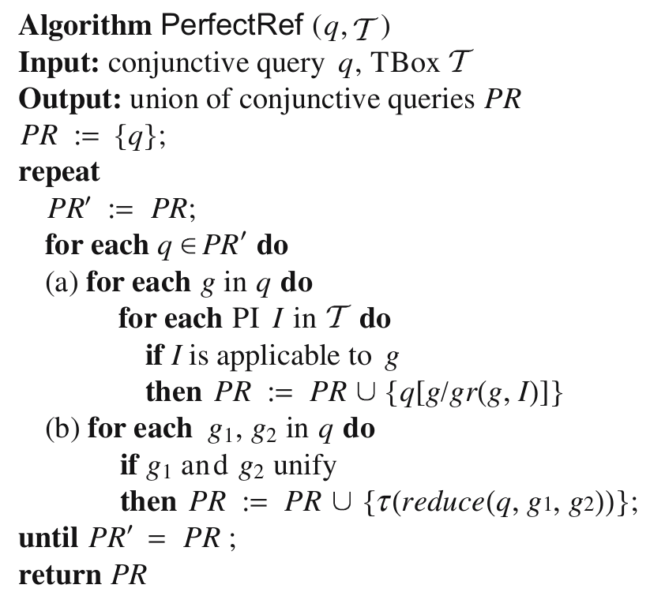

# PerfectRef

PerfectRef is an algorithm for query reformulation, published in the paper 
“Tractable Reasoning and Efficient Query Answering in Description Logics: The DL-Lite Family” [p. 414 - 422] by Calvanese et al. 
The algorithm takes a TBox and a Conjunctive query, and outputs a union of conjunctive queries constructed using the TBox.

## This implementation
This implementation of PerfectRef is done based on my interpretation of the presentation of the algorithm. It is implemented using Python 3.9.
The TBox should be on a format interpretable by OWLReady2: RDF/XML, OWL/XML, NTriples.
The input string should abide to the following rules:

* Each variable should be one letter, and start with ‘?’.
* The head and the body of the query is separated with ‘:-’.
* Each conjunction is separated with ‘^’

An example query is
q(?x) :- Student(?x)^hasTutor(?x,?y)

## Dependencies
PerfectRef code is dependent on Python library [OWLReady2](https://bitbucket.org/jibalamy/owlready2/src/master/) >= v0.36.

## Installation
Clone folder and place it in site-packages.
