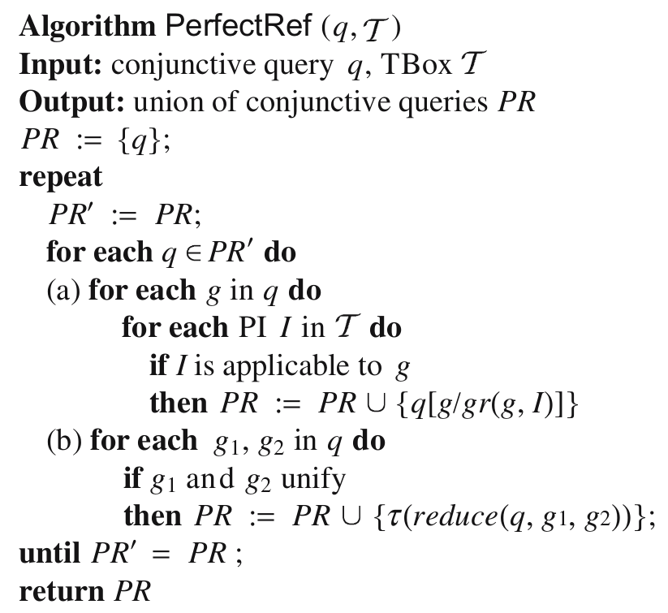

# PerfectRef

[](https://github.com/AImenes/PerfectRef/actions/workflows/ci.yml)

A Python implementation of **PerfectRef**, the query reformulation algorithm for
DL-Lite from

> Calvanese, De Giacomo, Lembo, Lenzerini, Rosati.
> *DL-Lite: Tractable Description Logics for Ontologies.* AAAI 2005.
> (and *Tractable Reasoning and Efficient Query Answering in Description
> Logics: The DL-Lite Family*, JAR 2007, for role inclusions.)

Given a conjunctive query `q` and a DL-Lite TBox `T`, PerfectRef compiles the
TBox into the query: it returns a union of conjunctive queries whose answers over
any ABox are exactly the certain answers of `q` over the knowledge base
`(T, A)`. The ontology is only needed at rewriting time; the rewritten union can
be evaluated by a plain database, a triple store, or, as in
[query-answering-and-embeddings](https://github.com/AImenes/query-answering-and-embeddings),
a knowledge graph embedding model.



## Installation

```bash
pip install git+https://github.com/AImenes/PerfectRef
```

Requires Python 3.9+ and [owlready2](https://bitbucket.org/jibalamy/owlready2/src/master/)
(installed automatically) for reading OWL ontologies in RDF/XML, OWL/XML or
NTriples.

## Quick start

```python
import perfectref as pr

tbox = pr.load_tbox("tests/data/university.owl")      # OWL → DL-Lite positive inclusions
result = pr.rewrite("q(?x) :- teachesTo(?x, ?y) ^ hasTutor(?y, _)", tbox)

for q in result:
    print(pr.format_query(q, tbox))
```

```
q(?x) :- teachesTo(?x, ?y) ^ hasTutor(?y, _)
q(?x) :- isTaughtBy(?y, ?x) ^ hasTutor(?y, _)
q(?x) :- supervises(?x, ?y) ^ hasTutor(?y, _)
q(?x) :- teachesTo(?x, ?y) ^ Student(?y)
...
q(?x) :- teachesTo(?x, _)
q(?x) :- Professor(?x)
q(?x) :- hasTutor(_, ?x)
```

(`university.owl` is the paper's Example 1 plus an inverse property and a
sub-property, hence the extra `isTaughtBy` and `supervises` rewritings. With the
paper's four inclusions alone you get exactly its six queries, see
`tests/test_algorithm.py`.)

The same from the command line:

```bash
perfectref rewrite tests/data/university.owl "q(?x) :- teachesTo(?x,?y) ^ hasTutor(?y,_)"
perfectref rewrite tests/data/university.owl "q(?x) :- Student(?x)" --format sparql
perfectref rewrite tests/data/university.owl "q(?x) :- Student(?x)" --format json --max 50
perfectref tbox examples/ontologies/pizza.owl --skipped      # which axioms were (not) used
```

`examples/basic_usage.py` walks through the API on the Pizza ontology.

### Query syntax

```
q(?x, ?y) :- Professor(?x) ^ teachesTo(?x, ?y) ^ knows(?y, "Tom Jones")
```

* head and body are separated by `:-`, `<-` or `←`; atoms by `^`, `∧`, `,` or `&`;
* variables start with `?` and may be any length; `_` or `?_` is an anonymous
  (non-distinguished, non-shared) variable;
* anything else in argument position is a constant (`"…"` or `<…>` if it contains
  separators);
* predicates are short names, resolved against the ontology, or full IRIs
  (`<http://…#Student>(?x)`). An ambiguous short name raises
  `AmbiguousNameError` listing the candidates.

### TBox syntax

A TBox can also be written by hand, which is convenient for tests:

```python
paper = pr.parse_tbox("""
    Professor ⊑ ∃TeachesTo        # A <= exists P also works
    Student ⊑ ∃HasTutor
    ∃TeachesTo⁻ ⊑ Student         # P^- is the ASCII spelling of P⁻
    ∃HasTutor⁻ ⊑ Professor
    supervises ⊑ TeachesTo        # role inclusion
""")
```

### Output formats

* `format_query(q, tbox)` – text, as above;
* `to_dict(q, tbox)` – JSON-friendly structure with predicates, IRIs and terms;
* `to_sparql(result.queries)` – a `SELECT … WHERE { {…} UNION {…} }` query over
  an RDF ABox;
* the `ConjunctiveQuery` objects themselves (`q.head`, `q.body`, each atom with
  `.predicate` and `.terms`) are immutable, hashable plain data.

`rewrite(..., max_rewritings=N)` stops after `N` queries; `result.truncated`
tells you whether that happened. PerfectRef's output can be exponential in the
number of body atoms, so a cap is useful for exploratory queries over large
hierarchies.

## What the OWL loader understands

Every positive inclusion emitted is entailed by the ontology, so rewriting stays
sound; axioms outside DL-Lite are listed in `tbox.skipped`.

| OWL                                              | DL-Lite                         |
| ------------------------------------------------ | ------------------------------- |
| `A SubClassOf B`, `A EquivalentTo B`             | `A ⊑ B` (both ways for ≡)       |
| `A SubClassOf P some C` / `min 1` / `value`      | `A ⊑ ∃P` (filler dropped)       |
| `A SubClassOf inverse(P) some C`                 | `A ⊑ ∃P⁻`                       |
| `A SubClassOf B and C`                           | `A ⊑ B`, `A ⊑ C`                |
| `B or C SubClassOf A`, `A EquivalentTo B or C`   | `B ⊑ A`, `C ⊑ A`                |
| `P some Thing SubClassOf A` (general axiom)      | `∃P ⊑ A`                        |
| `P Domain A` / `P Range A`                       | `∃P ⊑ A` / `∃P⁻ ⊑ A`            |
| `P SubPropertyOf Q` / `inverse(Q)`               | `P ⊑ Q` / `P ⊑ Q⁻`              |
| `P InverseOf Q`, `P EquivalentTo Q`, `P Symmetric` | `P ⊑ Q⁻` & `Q ⊑ P⁻`, `P ⊑ Q` & `Q ⊑ P`, `P ⊑ P⁻` |

Not translated: disjointness and other negative information, functionality,
transitivity, `only` restrictions, qualified existentials on the left-hand side,
unions on the right-hand side, intersections on the left-hand side, nominals,
data properties. Imported ontologies are followed (`include_imports=False` to
turn that off).

## The algorithm

```
PerfectRef(q, T):
  P := {q}
  repeat
    P' := P
    for each q ∈ P'
      (a) for each atom g of q, for each PI I ∈ T applicable to g:  P := P ∪ { q[g / gr(g, I)] }
      (b) for each pair of atoms g1, g2 of q that unify:              P := P ∪ { τ(reduce(q, g1, g2)) }
  until P' = P
```

* An argument is *bound* if it is a constant, a distinguished variable or a
  variable shared by two body atoms; otherwise it is *unbound* (`_`).
* `I` is applicable to `A(x)` if its right-hand side is `A`; to `P(x, _)` if it
  is `∃P`; to `P(_, x)` if it is `∃P⁻`; and a role inclusion `R ⊑ P` (or `R ⊑ P⁻`)
  is applicable to any `P(x1, x2)`.
* `reduce` applies the most general unifier of two atoms to the whole query.
  Variables that stop being shared become `_`, which can make further inclusions
  applicable. Unifying two distinguished variables, or a distinguished variable
  with a constant, specialises the head (`q(?x, ?x)`).

Implementation notes (`perfectref/algorithm.py`, `perfectref/model.py`):

* queries are kept in the paper's τ normal form, so "unbound" is simply the
  anonymous term `_`;
* the fixpoint loop is a work-list: every query is expanded once, membership in
  `P` is a hash lookup on a canonical key that ignores atom order and the names
  of existential variables, so the run time is linear in the size of the output
  (about 0.1–0.2 ms per rewriting on the Pizza ontology);
* duplicate atoms are collapsed eagerly (`R(x,_) ^ R(x,_)` is `R(x,_)`), which
  is what `reduce` would do with them anyway.

## Compatibility with 1.x

Version 1 was a folder dropped into `site-packages`; version 2 is a package.
The 1.x API is kept in `perfectref.legacy` and re-exported from the top level:

```python
import perfectref as pr                 # was: import perfectref_v1 as pr

PR = pr.get_entailed_queries("ontology.owl", "q(?x) :- Student(?x)^hasTutor(?x,?y)", upperlimit=100)
for body in PR:                          # list of QueryBody, first one is the input
    for atom in body.body:               # AtomConcept / AtomRole with .name, .iri, .var1, .var2
        print(atom.var1.original_entry_name, atom.var1.shared, atom.var1.distinguished)
```

`Query`, `QueryBody`, `AtomParser`, `AtomConcept`, `AtomRole`, `AtomConstant`,
`Variable`, `Constant`, `parse_output`, `print_query` and `export_query_to_file`
keep their signatures and attributes; `get_entailed_queries(..., parse=False)`
still accepts `Query` objects built by client code. Differences worth knowing:

* `get_entailed_queries` no longer prints every rewriting (pass `verbose=True`);
* `upperlimit=None` (the default) means unlimited instead of crashing;
* ontologies given by path are cached, so rewriting thousands of queries no
  longer reloads the file each time;
* rewritings carry their head in `body.head`; results are picklable;
* fixes compared with 1.x: role inclusions are now applied to `P(_, y)` (they
  were skipped), `?_` written twice is no longer treated as a shared variable,
  `inverse_of` is translated as `P ⊑ Q⁻` instead of `P⁻ ⊑ P`, constants work,
  general class axioms, equivalent classes, symmetric and equivalent properties
  are read, and duplicates are detected regardless of atom order. Expect a few
  more (correct) rewritings than before for the same query.

## Development

```bash
pip install -e ".[dev]"
pytest          # unit tests, including Example 1 of the paper reproduced exactly
ruff check perfectref tests
```

`tests/data/university.owl` is the paper's university TBox extended with a role
inclusion, an inverse property, a symmetric property, a general class axiom and
an equivalent class; `examples/ontologies/pizza.owl` is the Manchester Pizza
ontology.
